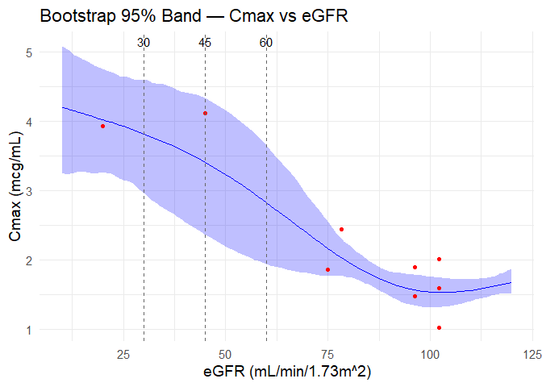
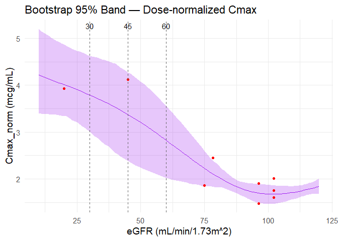
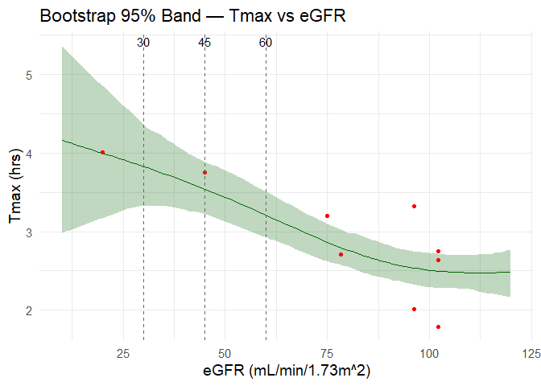

# Simulation of Metforming Pharmacokinetics using Monte Carlo and Bootstrap

## Introduction
Metformin is a well-established, first-line drug used to manage blood glucose in patients with type 2 diabetes. The medication is generally considered safe and effective, but the buildup of excessive drug in the system due to inadequate elimination might result in serious adverse effects, such as lactic acidosis. [1]
Therefore, the medication label and dosing guidelines have set dose adjustments for renally impaired patients, using estimated Glomerular Filtration Rate (eGFR) as a metric: [1], [2]
1)	eGFR < 30 mL/min/1.73 m2: Contraindicated (Do not take)
2)	30 < eGFR < 45: 
a.	Do not initiate metformin in new patients
b.	If the patient is on metformin, reassess benefit vs. risk
c.	Some sources suggest taking a reduced dose
3)	45< eGFR < 60: 
a.	No instant adjustment is needed
b.	Check the kidney function every 3 to 6 months.
The goal of the study is to use computational statistics to:
1)	Simulate and estimate metformin pharmacokinetics across different eGFR values
2)	Find consistency or differences compared to the dosing recommendations.
The structure of the project largely referenced “Spline-based procedures for dose-finding studies with active control,” (Helms et al, 2015) which investigated dosing regimen of antidiabetic medications using spline methods. [3]

## Monte Carlo Simulation of the Population
In the project, the population groups were simulated using Monte Carlo (n=1,000). Monte Carlo in this case has advantages as it is more cost- and time- effective than collecting observed population data and removing sensitive information. It is also beneficial in investigating topics with ethical issues, which is the topic of the study might face in the real world, as the study involves critically ill patients and may exposure subjects to health risks.
The mean and standard deviations of the parameters were collected from the package insert of metformin. [1] Because the insert did not include eGFR values, the values were imputed using a population-based study in Germany and the KDIGO Chronic Kidney Disease Guideline. [4]], [5]
For parameters, Cmax and Tmax were simulated using log-normal distribution because log-normal distribution is considered to describe pharmacokinetic parameters and is used often in studies. [6]

## Using Splines with GAM to Estimation of Pharmacokinetic Functions
To estimate how Cmax and Tmax relate to eGFR, smoothing splines with generalized additive model (GAM) was used. Splines are preferred over parametric techniques when the observed function is unknown or does not follow a parametric form. The pharmacokinetics of medications vary over products and formulations, so a specific distribution could not be assumed. Unlike linear regression, splining can also include multiple equations along the intervals, so it is useful when the slope and curvature may vary across the x-axis. [7], [8]
Generalized additive model (GAM) was used to reduce the risk of overfitting from noises and outliers as well as to avoid arbitrarily setting the intervals which may affect the prediction of the curve. In the study, k=4 was used to set the nodes. [7]

## Using Bootstrapping to Construct Confidence Bands
Pointwise bootstrapping was applied to build the 95% confidence bands. In pointwise bootstrapping, the steps are as follows:
1)	Re-simulate and replace the simulated dataset
2)	Fit the spline models to the newly bootstrapped dataset
3)	At each x, there will be curves as many as the set number of bootstrap samples. (B)
4)	Using the set upper and lower bounds, the curves within the range will form the band.
5)	As a result, the chance that x is within the band equal]s the level of confidence. [8]
In the study, B=300 and the 95% confidence level were used.
The disadvantage of pointwise bootstrapping is that it is parametric and might not capture the actual confidence level perfectly. The method, compared to global bootstrapping, does not take the “simultaneous inference” into account, which can affect the width of the band. [8] However, due to limited resources, pointwise bootstrapping was used here.

## Results and Discussion
### Cmax and Dose-Normalized Cmax vs. eGFR

Graphs 1 and 2. Cmax vs. eGFR (Left) and Dose-normalized Cmax vs. eGFR (Right)

Both raw and dose-normalized Cmax curves show that both the mean and confidence interval of Cmax increases as the renal function declines. This is consistent with the established finding the drug is eliminated through kidneys and patients with renal impairment can be at risk of toxicity buildup and adverse effects.
The mean Cmax at eGFR = 30 mL/min/1.73m2 is twice higher than the mean of Cmax at eGFR = 90, regardless of the dose-normalization. Also, the confidence band is markedly wider at eGFR=30. This implies the pharmacodynamics in people with severe kidney diseases are much less predictable and therefore metformin therapy might not be safe. The finding is consistent with the current dosing guidelines where metformin use is contraindicated in patients with eGFR < 30mL/min/1.73m2. [1], [2]
When eGFR lies between 30 and 45 mL/min/1.73m2, the confidence band is still significantly wider than at eGFR = 90, but the mean Cmax is lower than the contraindicated group. This is consistent with all the recommendations: Starting a new metformin therapy is generally discouraged, but continuation or reduction of the dose might be justified based on each patient’s situation. [2]
Overall, the splined curve and the confidence bands are consistent with the known facts about metformin.

### Tmax vs. eGFR

 
Graph 3. Tmax vs. eGFR.

The Tmax is less dramatic than Cmax in terms of its relationship with eGFR but still decreases as the eGFR increases. The Tmax at eGFR < 30 mL/min/1.73m2 has markedly wider confidence band than Tmax at higher eGFR values, implying the patients whose eGFR is severely low might be reaching peak concentration much faster or slower than the others.
This is also consistent with the guideline where eGFR<30 is a contraindication to taking metformin because the specific group may have risk of staying out of the safe therapeutic range over time.

## Limitations
1. It is also important that the goal of the project is to compare findings from simulated and observed population, not to provide medical or pharmacokinetic findings.
2. The eGFR values were imputed consulting other sources, so it might not be consistent with the eGFR profile of those who participated in the original Cmax and Tmax study.
3. There are different spline models and number of knots, but only one model and one k value were tested. Comparing the results with other spline models, k values, or other estimation techniques can provide further insight into the data. Finally, the parametric nature of pointwise bootstrapping might not have fully captured the confidence interval of the actual data.

## Conclusion
Overall, the simulated project revealed the mean and confidence interval of Cmax and Tmax increases as the renal function declines, and it was most extreme when the eGFR fell below 30 mL/min/1.73m2. This is consistent with the package insert and clinical guideline of metformin use, where the drug is contraindicated in those with eGFR < 30 mL/min/1.73m2 and risk-benefit analysis or regular monitoring needs to be performed in patients with milder kidney disease. Further simulations may help find patterns of pharmacokinetic profile of metformin in diverse populations.

## References
1. METFORMIN HYDROCHLORIDE tablet, film coated [Internet]. Bethesda, MD: National Institute of Health; 2020. [cited November 9, 2025] Available from: https://dailymed.nlm.nih.gov/dailymed/drugInfo.cfm?setid=56d13a1c-b289-4528-b23c-60f5427b4552
2. Corcoran C, Jacobs TF. Metformin. [Updated 2023 Aug 17]. In: StatPearls [Internet]. Treasure Island (FL): StatPearls Publishing; 2025 Jan-. [cited November 9, 2025] Available from: https://www.ncbi.nlm.nih.gov/books/NBK518983/
3. Helms HJ, Benda N, Zinserling J, Kneib T, Friede T. Spline-based procedures for dose-finding studies with active control. Stat Med. 2015 Jan 30;34(2):232-48.
4. Herold JM, Wiegrebe S, Nano J, Jung B, Gorski M, Thorand B, Koenig W, Zeller T, Zimmermann ME, Burkhardt R, Banas B, Küchenhoff H, Stark KJ, Peters A, Böger CA, Heid IM, Population-Based Reference Values for Kidney Function and Kidney Function Decline in 25- to 95-Year-Old Germans without and with Diabetes. Kidney Int [Internet]. 2024;106(4): 699-711.
5. Kidney Disease: Improving Global Outcomes (KDIGO) CKD Work Group. KDIGO 2024 Clinical Practice Guideline for the Evaluation and Management of Chronic Kidney Disease. Kidney Int [Internet]. 2024 Apr;105(4S):S117-S314
6. Elassaiss-Schaap J, Duisters K. Variability in the Log Domain and Limitations to Its Approximation by the Normal Distribution. CPT Pharmacometrics Syst Pharmacol [Internet]. 2020 May;9(5):245-257.
7. Saranya S, Christy S, Kumari VS. Predictive Frameworks for Osteoporosis Identification. In: Recent Trends in Advanced Computing: 7th International Conference, ICRTAC 2024, Chennai, India, November 14–15, 2024, Proceedings. (2025). Switzerland: Springer Nature Switzerland, 2025, p.64-76.
8. Givens GH, Hoetings JA. Computational Statistics: Second Edition. Hoboken, NJ: Wiley, 2013.
