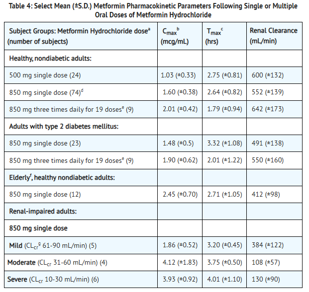

```{r echo = FALSE}
knitr::opts_chunk$set(fig.align="left", out.width="80%")
```


# The Original Pharmacokinetics Table
(https://dailymed.nlm.nih.gov/dailymed/drugInfo.cfm?setid=56d13a1c-b289-4528-b23c-60f5427b4552)
```{r echo = FALSE}

```


# 1. Libraries and Dataset
```{r echo = TRUE}


## 1. Libraries and Dataset

# Import libraries
library(tidyverse)
library(mgcv)
library(patchwork)

set.seed(123)


# Build the Dataset
# eGFR imputed using Herold et al.(2024) and KDIGO CKD Guideline (2024)
df = tribble(
  ~group,                   ~dose_mg, ~regimen,   ~eGFR_mean, ~eGFR_sd, 
  ~Cmax_mean, ~Cmax_sd, ~Tmax_mean, ~Tmax_sd, ~n,
  "Healthy 500mg single",        500, "single",      102.23,  14.18,      
  1.03,      0.33,     2.75,      0.81,     24,
  "Healthy 850mg single",        850, "single",      102.23,  14.18,      
  1.60,      0.38,     2.64,      0.82,     74,
  "Healthy 850mg TID×19",        850, "multiple",    102.23,  14.18,     
  2.01,      0.42,     1.79,      0.94,      9,
  "T2D 850mg single",            850, "single",       96.32,  17.22,      
  1.48,      0.50,     3.32,      1.08,     23,
  "T2D 850mg TID×19",            850, "multiple",     96.32,  17.22,     
  1.90,      0.62,     2.01,      1.22,      9,
  "Elderly 850mg single",        850, "single",       78.32,  14.93,      
  2.45,      0.70,     2.71,      1.05,     12,
  "CKD mild (G2) 850mg",         850, "single",       75,        10,      
  1.86,      0.52,     3.20,      0.45,      5,
  "CKD moderate (G3) 850mg",     850, "single",       45,        10,      
  4.12,      1.83,     3.75,      0.50,      4,
  "CKD severe (G4) 850mg",       850, "single",       20,         6,      
  3.93,      0.92,     4.01,      1.10,      6
)

```

# 2. Simulate the Population

```{r echo = TRUE}
## 2. Simulate the Population

# Set the number of simulations for each group
Nsim = 1000 # n = 1000

# Prepare for lognormal Distribution
ln_params = function(m, s) {
  # SD cannot be <=0 (If so, replace with 1e-6)
  s = ifelse(s <= 0, 1e-6, s)
  # Variance = SD^2
  v = s^2
  # Log-scale SD
  phi = sqrt(log(1 + v / m^2))
  # Log-scale mean
  mu  = log(m) - 0.5 * phi^2
  list(meanlog = mu, sdlog = phi)
}

# Simulate the data
sim_data = df %>%
  # Group by the subject group
  group_by(group) %>%
  # For each group, (healthy, t2dm, elderly, renal)
  do({
    this = . # Data for the current group
    
    # Cmax and Tmax for lognormal distribution
    pC = ln_params(this$Cmax_mean, this$Cmax_sd)
    pT = ln_params(this$Tmax_mean, this$Tmax_sd) 
  
    # Simulate the distributions
    tibble(
      group   = this$group,
      regimen = this$regimen,
      dose_mg = this$dose_mg,
      eGFR    = rnorm(Nsim, this$eGFR_mean, this$eGFR_sd), # 1000 eGFR, normal
      Cmax    = rlnorm(Nsim, pC$meanlog, pC$sdlog), # 1000 Cmax, lognormal
      Tmax    = rlnorm(Nsim, pT$meanlog, pT$sdlog) # 1000 Tmax, lognormal
    )
  }) %>%
  ungroup() %>%
  mutate(
    eGFR      = pmin(pmax(eGFR, 5), 130), # Set the upper/lower bounds for eGFR
    Cmax_norm = Cmax / dose_mg * 850 # Normalize exposures (Rescale to 850 mg)
  )
```

# 3. Fit the Parameters to Spline (k= 4)
```{r echo = TRUE}
## 3. Fit the parameters to spline (k= 4)
# Generalized Additive Model (GAM) was used to minimize overfitting
gam_Cmax      = gam(Cmax      ~ s(eGFR, k = 4), data = sim_data) 
gam_Tmax      = gam(Tmax      ~ s(eGFR, k = 4), data = sim_data) 
gam_Cmax_norm = gam(Cmax_norm ~ s(eGFR, k = 4), data = sim_data) 

# Grid of 111 points (10, 11, ..., 119, 120)
grid = tibble(eGFR = seq(10, 120, by = 1))

# Values and Standard Error Prediction to calculate 95% CIs
pred_Cmax      = predict(gam_Cmax,      grid, se.fit = TRUE)
pred_Tmax      = predict(gam_Tmax,      grid, se.fit = TRUE)
pred_Cmax_norm = predict(gam_Cmax_norm, grid, se.fit = TRUE)

# Add fits and CIs to the grid
grid = grid %>%
  mutate(
    # Cmax
    Cmax_fit      = pred_Cmax$fit, # Point estimate
    Cmax_lwr      = Cmax_fit      - 1.96 * pred_Cmax$se.fit, # Lower 95% CI
    Cmax_upr      = Cmax_fit      + 1.96 * pred_Cmax$se.fit, # Upper 95% CI
    # Tmax
    Tmax_fit      = pred_Tmax$fit, # Point estimate
    Tmax_lwr      = Tmax_fit      - 1.96 * pred_Tmax$se.fit,  # Lower 95% CI
    Tmax_upr      = Tmax_fit      + 1.96 * pred_Tmax$se.fit, # Upper 95% CI
    # Normalized Cmax
    Cmax_norm_fit = pred_Cmax_norm$fit, # Point estimate
    Cmax_norm_lwr = Cmax_norm_fit - 1.96 * pred_Cmax_norm$se.fit, # Lower 95% CI
    Cmax_norm_upr = Cmax_norm_fit + 1.96 * pred_Cmax_norm$se.fit  # Upper 95% CI
  )

```

# 4. Build Plots for Cmax and Tmax
```{r echo = TRUE}

## 4. Build plots for Cmax and Tmax
# Build a Joint Plot
p_joint = ggplot() +
  
  # Cmax Confidence Band
  geom_ribbon(data = grid, 
              aes(eGFR, 
                  ymin = Cmax_lwr, 
                  ymax = Cmax_upr),
              fill = "blue", alpha = 0.1) +
  
  # Cmax Spline Curve
  geom_line(data = grid, 
            aes(eGFR, 
                Cmax_fit, color = "Cmax"), linewidth = 1) +
  
  # Tmax Confidence Band
  geom_ribbon(data = grid, 
              aes(eGFR, 
                 ymin = Tmax_lwr, 
                 ymax = Tmax_upr),
              fill = "darkgreen", alpha = 0.1) +
  
  # Tmax Spline Curve
  geom_line(data = grid, 
            aes(eGFR, Tmax_fit, color = "Tmax"), linewidth = 1) +
  
  # Mean Pharmacokinetic Values
  geom_point(data = df, 
             aes(eGFR_mean, Cmax_mean), 
             color = "blue", size = 2) +
  geom_point(data = df, 
             aes(eGFR_mean, Tmax_mean), 
             color = "darkgreen", size = 2) +

  # Legend (Blue=Cmax, Green=Tmax), Labels and Theme
  scale_color_manual(values = 
                       c("Cmax" = "blue", 
                         "Tmax" = "darkgreen")) +
  labs(
    x = "eGFR (mL/min/1.73m²)",
    y = "Value",
    color = "PK Parameter",
    title = "Cmax & Tmax vs eGFR"
  ) +
  theme_minimal(base_size = 14)

print(p_joint)
```
# 5. Bootstrapped Confidence Bands

```{r echo = TRUE}

## 5. Bootstrapped Confidence Bands

# Prepare for lognormal distribution
ln_params = function(m, s) {
  s = ifelse(s <= 0, 1e-6, s) # Prevent SD<=0
  phi = sqrt(log(1 + (s/m)^2)) # Lognormal SD
  mu  = log(m) - 0.5 * phi^2 # Lognormal mean
  list(meanlog = mu, sdlog = phi)
}

# Function for bootstrapping
bootstrap_band = function(
    param = c("Cmax", "Cmax_norm", "Tmax"), 
    B = 300) { # 300 bootstrap iterations
  param = match.arg(param)
  boot_mat = matrix(NA, nrow = B, ncol = nrow(grid))

  # Bootstrapping mean for each group
  for (b in 1:B) {
    df_b = df %>%
      mutate(
        eGFR_mean_b = rnorm(n(), eGFR_mean, eGFR_sd / sqrt(n)), # New mean eGFR
        Cmax_mean_b = rnorm(n(), Cmax_mean, Cmax_sd / sqrt(n)), # New mean Cmax
        Tmax_mean_b = rnorm(n(), Tmax_mean, Tmax_sd / sqrt(n)) # New mean Tmax
      )

    # Resimulate the dataset
    sim_b =
      df_b %>%
      group_by(group) %>%
      do({
        this = .
        
        # Convert to lognormal
        pC = ln_params(this$Cmax_mean_b, this$Cmax_sd) # Cmax
        pT = ln_params(this$Tmax_mean_b, this$Tmax_sd) # Tmax

        # Resimulate the eGFR, Cmax, and Tmax
        tibble(
          eGFR = rnorm(Nsim, this$eGFR_mean_b, this$eGFR_sd), # Normal dist
          Cmax = rlnorm(Nsim, pC$meanlog, pC$sdlog), # Lognormal
          Tmax = rlnorm(Nsim, pT$meanlog, pT$sdlog), # Lognormal
          dose_mg = this$dose_mg
        )
      }) %>%
      ungroup() %>%
      mutate(
        eGFR = pmin(pmax(eGFR, 5), 130), # Min eGFR=5, Max=130
        Cmax_norm = Cmax / dose_mg * 850 # Normalized Cmax
      )
    
    # Fit the GAM spline
    formula = switch(
      param,
      "Cmax"      = Cmax ~ s(eGFR, k = 4),
      "Cmax_norm" = Cmax_norm ~ s(eGFR, k = 4),
      "Tmax"      = Tmax ~ s(eGFR, k = 4)
    )

    gam_b = gam(formula, data = sim_b)

    # Make a new prediction
    boot_mat[b, ] = predict(gam_b, newdata = grid)

    if (b %% 20 == 0) cat(param, "bootstrap:", b, "\n")
  }

  # Bootstrap bands
  tibble(
    eGFR = grid$eGFR,
    fit = apply(boot_mat, 2, mean), # The mean curve
    lwr = apply(boot_mat, 2, quantile, 0.025), # 2.5% quantile curve
    upr = apply(boot_mat, 2, quantile, 0.975) # 97.5 quantile curve
  )
}

# Final Band Output

boot_Cmax      = bootstrap_band("Cmax")
boot_Cmax_norm = bootstrap_band("Cmax_norm")
boot_Tmax      = bootstrap_band("Tmax")

```
# 6. Plot the confidence bands

```{r echo = TRUE}
## 6. Plot the confidence bands

# Cmax, bootstrapped (Blue)
p_boot_Cmax = ggplot(boot_Cmax, aes(eGFR, fit)) +
  
  # Cmax curve with bootstrapped confidence band
  geom_ribbon(aes(ymin = lwr, ymax = upr), fill = "blue", alpha = 0.25) +
  geom_line(color = "blue") +
  
  # Observed Cmax means (red)
  geom_point(data = df, aes(eGFR_mean, Cmax_mean), color = "red") + 
  
  # Vertical lines at eGFR = 30, 45, 60
  geom_vline(xintercept = c(30, 45, 60),
             linetype = "dashed", color = "grey40") +
  annotate("text", x = 30, y = Inf, label = "30", vjust = 1.5, size = 4) +
  annotate("text", x = 45, y = Inf, label = "45", vjust = 1.5, size = 4) +
  annotate("text", x = 60, y = Inf, label = "60", vjust = 1.5, size = 4) +
  
  # Labels and theme
  labs(x = "eGFR (mL/min/1.73m^2)", y = "Cmax (mcg/mL)",
       title = "Bootstrap 95% Band — Cmax vs eGFR") +
  theme_minimal(14)

# Normalized Cmax, bootstrapped (purple)
p_boot_Cmax_norm = ggplot(boot_Cmax_norm, aes(eGFR, fit)) +
  
  # Normalized Cmax curve with bootstrapped confidence band
  geom_ribbon(aes(ymin = lwr, ymax = upr), fill = "purple", alpha = 0.25) +
  geom_line(color = "purple") +
  
  # Observed Normalized Cmax means (red)
  geom_point(data = df, 
             aes(eGFR_mean, Cmax_mean / dose_mg * 850), color = "red") +
  
  # Vertical lines and annotations at eGFR = 30, 45, 60
  geom_vline(xintercept = c(30, 45, 60),
             linetype = "dashed", color = "grey40") +
  annotate("text", x = 30, y = Inf, label = "30", vjust = 1.5, size = 4) +
  annotate("text", x = 45, y = Inf, label = "45", vjust = 1.5, size = 4) +
  annotate("text", x = 60, y = Inf, label = "60", vjust = 1.5, size = 4) +
  
  # Labels and theme
  labs(x = "eGFR (mL/min/1.73m^2)", y = "Cmax_norm (mcg/mL)", 
       title = "Bootstrap 95% Band — Dose-normalized Cmax") +
  theme_minimal(14)


# Tmax, bootstrapped (Green)
p_boot_Tmax = ggplot(boot_Tmax, aes(eGFR, fit)) +
  
  # Tmax curve with bootstrapped confidence band
  geom_ribbon(aes(ymin = lwr, ymax = upr), fill = "darkgreen", alpha = 0.25) +
  geom_line(color = "darkgreen") +
  
  # Observed Tmax means (red)
  geom_point(data = df, aes(eGFR_mean, Tmax_mean), color = "red") +
  
  # Vertical lines and annotation at eGFR = 30, 45, 60
  geom_vline(xintercept = c(30, 45, 60),
             linetype = "dashed", color = "grey40") +
  annotate("text", x = 30, y = Inf, label = "30", vjust = 1.5, size = 4) +
  annotate("text", x = 45, y = Inf, label = "45", vjust = 1.5, size = 4) +
  annotate("text", x = 60, y = Inf, label = "60", vjust = 1.5, size = 4) +

  
  # Labels and theme
  labs(x = "eGFR (mL/min/1.73m^2)", y = "Tmax (hrs)", 
       title = "Bootstrap 95% Band — Tmax vs eGFR") +
  theme_minimal(14)

print(p_boot_Cmax)
print(p_boot_Cmax_norm)
print(p_boot_Tmax)

```
# 7. Compare the Three Curves

```{r echo = TRUE}

## 7. Compare the Three Curves

# Combine Cmax, Normalized Cmax, and Tmax curves with confidence bands
combined_boot = (
  p_boot_Cmax / p_boot_Cmax_norm / p_boot_Tmax
) +
  plot_annotation(
    title = "Metformin PK vs eGFR — Bootstrap 95% Confidence Bands",
    subtitle = "Cmax, Dose-normalized Cmax, and Tmax",
    theme = theme(
      plot.title = element_text(size = 18, face = "bold"),
      plot.subtitle = element_text(size = 14)
    )
  )

print(combined_boot)


```
